# Trabalho de Banco de Dados

Projeto da disciplina Banco de dados com o objetivo de criar um banco de dados funcional, aplicando os conhecimentos obtidos na disciplina.

## Integrantes

Professor: 

[Francisco Vital](https://www.linkedin.com/in/francisco-vital-0b5b0021/)

Alunos:

- [Cayo Capuxy](https://github.com/capuxy)
- [Hedvaldo Costa](https://github.com/HedvaldoCosta)
- [Gustavo Caruazu](www.caruazu.com)
- [Jose Matheus](https://github.com/ZeMatheusDev)
	
## Resultados

### Modelo entidade relacionamento

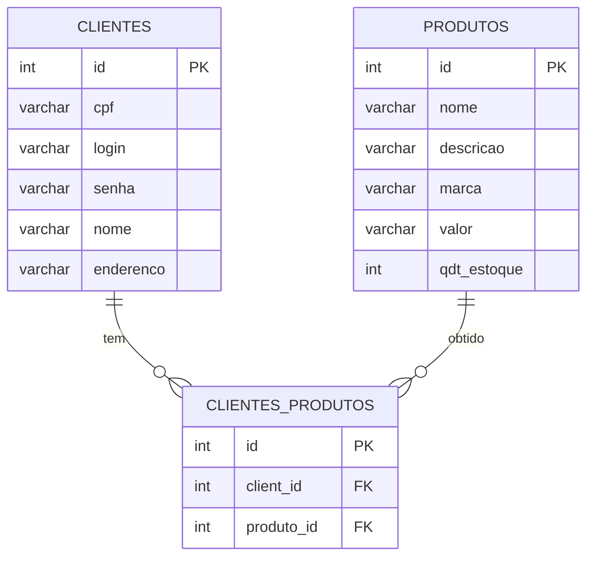

### Criação
### Inserção
### Alteração
### Exclusão

### Consultas

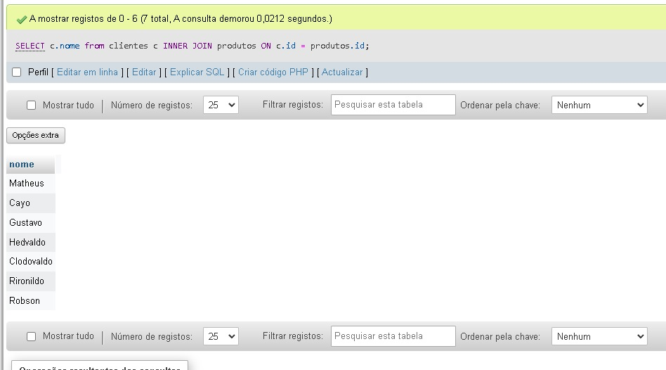
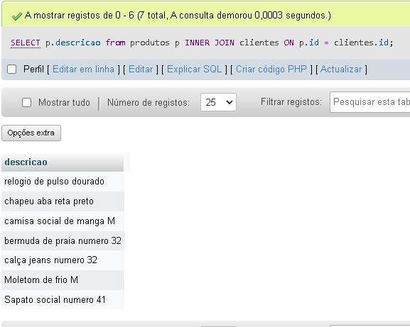
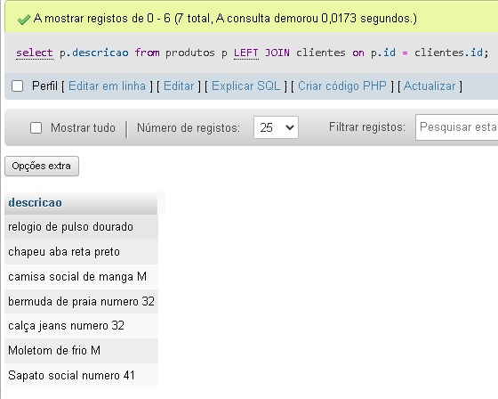
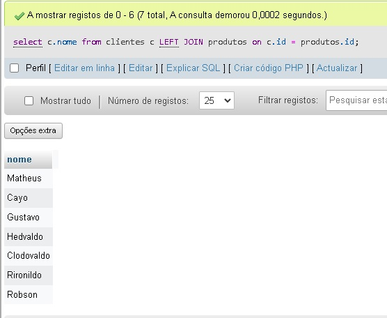
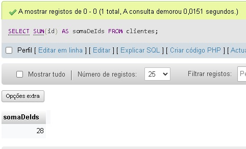
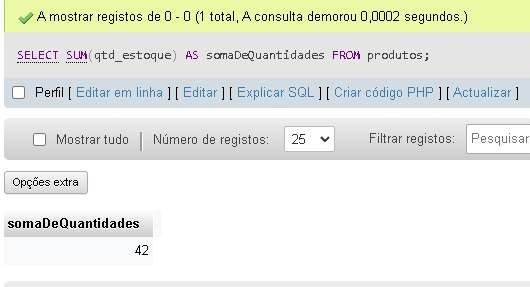
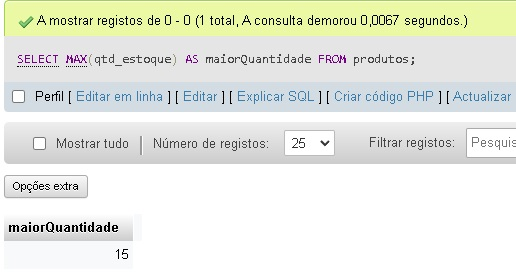
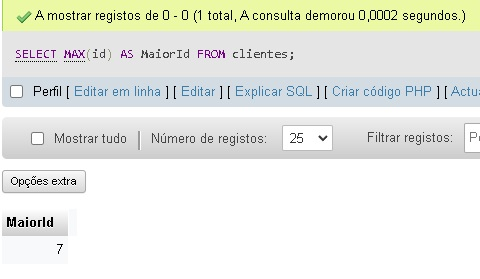
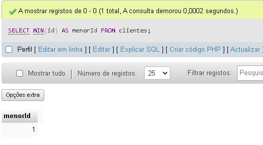
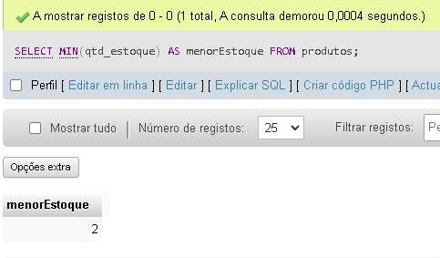
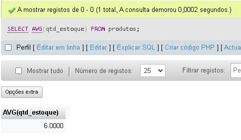
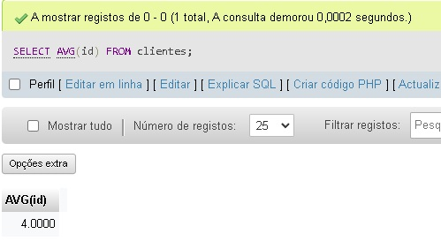
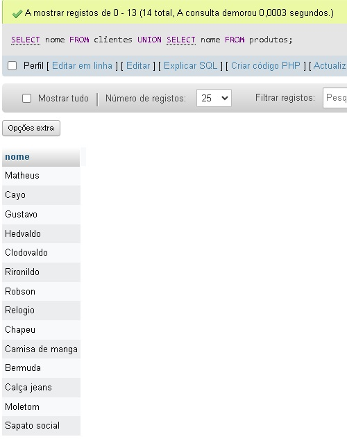
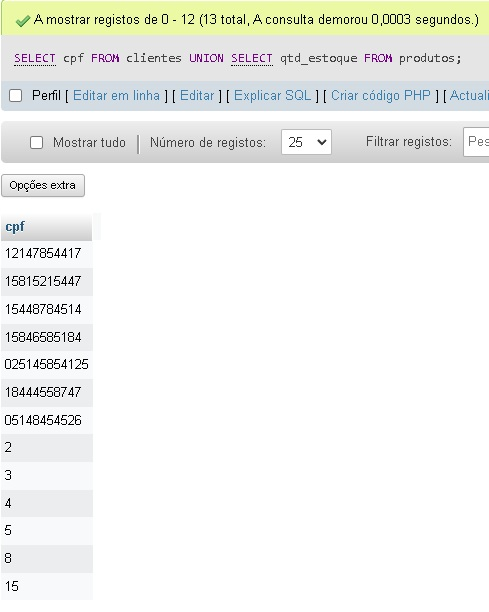
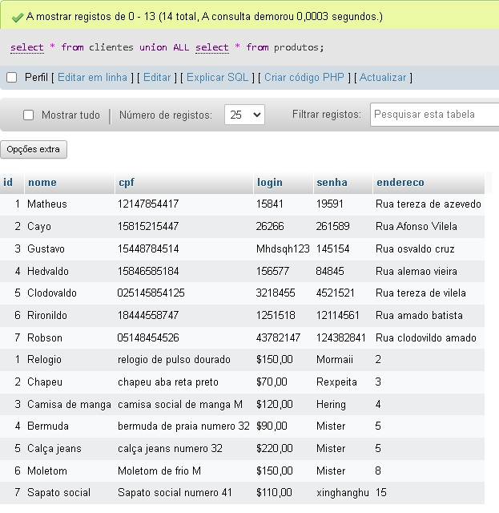
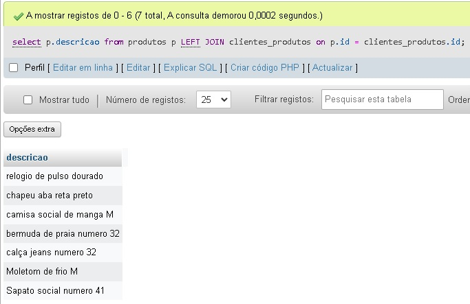
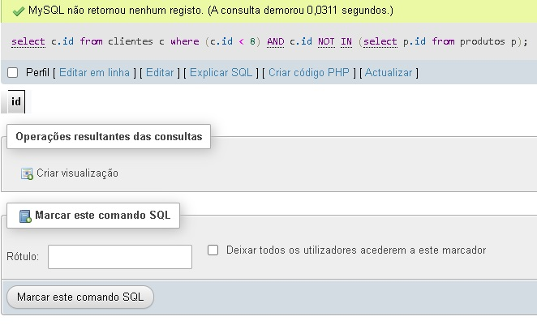
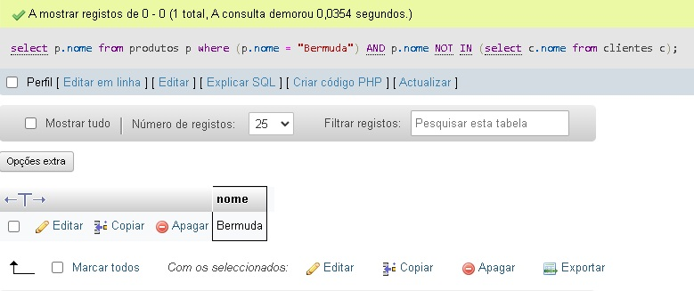
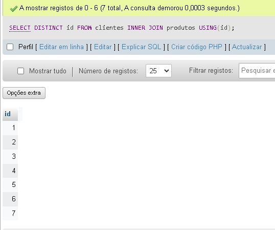
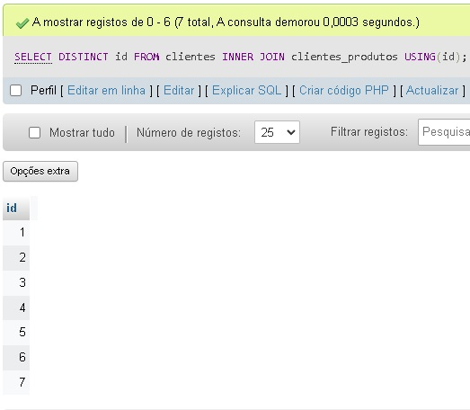