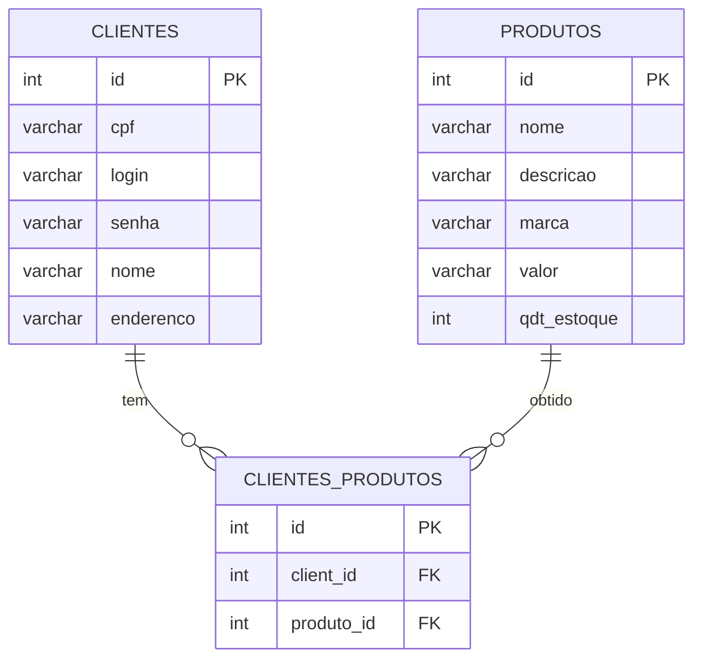

# Modelo entidade relacionamento

```mermaid
erDiagram

CLIENTES ||--o{ CLIENTES_PRODUTOS : tem 
CLIENTES{
    int id PK
    varchar cpf
    varchar login
    varchar senha
    varchar nome
    varchar enderenco
}

PRODUTOS ||--o{ CLIENTES_PRODUTOS : obtido
PRODUTOS {
    int id PK
    varchar nome
    varchar descricao
    varchar marca
    varchar valor
    int qdt_estoque
}

CLIENTES_PRODUTOS {
    int id PK
    int client_id FK
    int produto_id FK
}
```